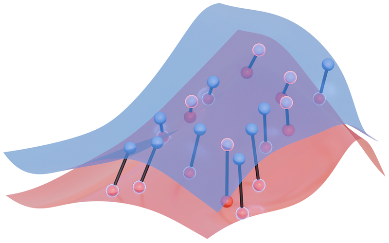

.. kompot documentation master file

.. toctree::
   :hidden:
   :maxdepth: 2
   :caption: Modules:

   Differential Analysis <differential>
   AnnData Integration <anndata>
   Plotting <plotting>
   Utilities <utils>

.. toctree::
   :hidden:
   :caption: Tutorials:
   :maxdepth: 2

   Tutorial Notebook <notebooks/tutorial_notebook.ipynb>
   Sample Variance Analysis <notebooks/sample_variance.ipynb>

.. |pypi| image:: https://img.shields.io/pypi/v/kompot.svg
   :target: https://pypi.org/project/kompot/
   :alt: PyPI

.. |tests| image:: https://github.com/settylab/kompot/actions/workflows/tests.yml/badge.svg
   :target: https://github.com/settylab/kompot/actions/workflows/tests.yml
   :alt: Tests

.. |codecov| image:: https://codecov.io/gh/settylab/kompot/branch/main/graph/badge.svg
   :target: https://codecov.io/gh/settylab/kompot
   :alt: Coverage

.. |docs| image:: https://readthedocs.org/projects/kompot/badge/?version=latest
   :target: https://kompot.readthedocs.io/en/latest/?badge=latest
   :alt: Documentation Status

|pypi| |tests| |codecov| |docs|

Kompot
======

Kompot is a Python package for differential abundance and gene expression analysis using Gaussian Process models with JAX backend.

Overview
--------

Kompot implements methodologies from the Mellon package for computing differential abundance and gene expression, with a focus on using Mahalanobis distance as a measure of differential expression significance. It leverages JAX for efficient computations and provides a scikit-learn like API with `.fit()` and `.predict()` methods.

Key features:

- Computation of differential abundance between conditions
- Gene expression imputation and uncertainty estimation
- Mahalanobis distance calculation for differential expression significance
- Weighted log fold change analysis with density difference weighting
- Support for covariance matrices and optional landmarks
- JAX-accelerated computations
- Empirical variance estimation
- **Disk-backed storage for large datasets** with Dask support
- Visualization tools (volcano plots, heatmaps, expression plots)
- **Full scverse compatibility with direct AnnData integration**

Use Cases
---------

Kompot is particularly useful for:

- Comparing cell type abundances across different samples
- Identifying differentially expressed genes between conditions
- Integrating multi-sample or multi-batch variability
- Analyzing large-scale single-cell datasets that don't fit in memory using disk-backed storage
- Creating visualizations of differential analysis results

Installation
-----------

To install the base package:

.. code-block:: bash

   pip install kompot

For additional plotting functionality with scanpy integration:

.. code-block:: bash

   pip install kompot[plot]

For disk-backed storage with Dask support (recommended for large datasets):

.. code-block:: bash

   pip install kompot[dask]

To install all optional dependencies:

.. code-block:: bash

   pip install kompot[all]

Quick Start
-----------

Check out our :doc:`Tutorial Notebook <notebooks/tutorial_notebook>` for a step-by-step introduction to Kompot's key functionality.

For more advanced applications involving sample-specific variance estimation, see the :doc:`Sample Variance Analysis <notebooks/sample_variance>` tutorial.

.. toctree::
   :hidden:
   :caption: Links:

    Setty Lab <http://setty-lab.org>
    Github Repo <https://github.com/settylab/kompot>

Index
=====

* :ref:`genindex`
