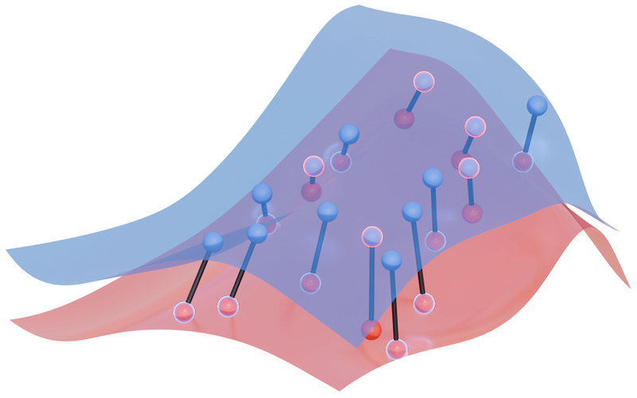

.. kompot documentation master file

.. toctree::
   :hidden:
   :maxdepth: 2
   :caption: User Guide:

   Installation <installation>
   Command-Line Interface <cli>

.. toctree::
   :hidden:
   :maxdepth: 2
   :caption: API Reference:

   Differential Analysis <differential>
   AnnData Integration <anndata>
   Plotting <plotting>
   Utilities <utils>

.. toctree::
   :hidden:
   :caption: Tutorials:
   :maxdepth: 2

   Getting Started <notebooks/01_getting_started.ipynb>
   Advanced Differential Expression <notebooks/02_differential_expression_detailed.ipynb>
   Sample Variance Analysis <notebooks/03_sample_variance.ipynb>

.. |doi| image:: https://zenodo.org/badge/944121568.svg
   :target: https://zenodo.org/badge/latestdoi/944121568
   :alt: DOI

.. |pypi| image:: https://img.shields.io/pypi/v/kompot.svg
   :target: https://pypi.org/project/kompot/
   :alt: PyPI

.. |tests| image:: https://github.com/settylab/kompot/actions/workflows/tests.yml/badge.svg
   :target: https://github.com/settylab/kompot/actions/workflows/tests.yml
   :alt: Tests

.. |codecov| image:: https://codecov.io/gh/settylab/kompot/branch/main/graph/badge.svg
   :target: https://codecov.io/gh/settylab/kompot
   :alt: Coverage

.. |docs| image:: https://readthedocs.org/projects/kompot/badge/?version=latest
   :target: https://kompot.readthedocs.io/en/latest/?badge=latest
   :alt: Documentation Status

|doi| |pypi| |tests| |codecov| |docs|

Kompot
======

Kompot is a Python package for differential abundance and gene expression analysis using Gaussian Process models with JAX backend.

Overview
--------

Kompot implements methodologies from the Mellon package for computing differential abundance and gene expression, with a focus on using Mahalanobis distance as a measure of differential expression significance. It leverages JAX for efficient computations and provides a scikit-learn like API with `.fit()` and `.predict()` methods.

Key features:

- Computation of differential abundance between conditions
- Gene expression imputation and uncertainty estimation
- Mahalanobis distance calculation for differential expression significance
- Weighted log fold change analysis with density difference weighting
- Support for covariance matrices and optional landmarks
- JAX-accelerated computations
- Empirical variance estimation
- **Resource estimation and dry run** for planning large analyses
- **Disk-backed storage for large datasets** with dask support
- Visualization tools (volcano plots, heatmaps, expression plots)
- **Full scverse compatibility with direct AnnData integration**
- **Command-line interface for pipeline integration** and batch processing

Use Cases
---------

Kompot is particularly useful for:

- Comparing cell type abundances across different samples
- Identifying differentially expressed genes between conditions
- Integrating multi-sample or multi-batch variability
- Analyzing large-scale single-cell datasets that don't fit in memory using disk-backed storage
- Creating visualizations of differential analysis results

Installation
------------

Install from PyPI:

.. code-block:: bash

   pip install kompot

Or via conda/mamba:

.. code-block:: bash

   conda install -c bioconda kompot

For optional dependencies and JAX GPU support, see the :doc:`installation guide <installation>`.

Quick Start
-----------

Python API
^^^^^^^^^^

**New to Kompot?** Start with the :doc:`Getting Started <notebooks/01_getting_started>` tutorial for a comprehensive introduction to differential abundance and expression analysis.

**Ready for more?** Explore advanced topics:

- :doc:`Advanced Differential Expression <notebooks/02_differential_expression_detailed>` - Parameter customization, multiple comparisons, and visualization options
- :doc:`Sample Variance Analysis <notebooks/03_sample_variance>` - Accounting for biological replicates in multi-sample studies

Command-Line Interface
^^^^^^^^^^^^^^^^^^^^^^^

**For pipeline integration and batch processing**, use the :doc:`Command-Line Interface <cli>`:

.. code-block:: bash

   # Compute diffusion maps (preprocessing)
   kompot dm input.h5ad -o input_dm.h5ad --pca-key X_pca

   # Run differential expression
   kompot de input_dm.h5ad -o results.h5ad \\
     --groupby condition --condition1 control --condition2 treatment \\
     --obsm-key DM_EigenVectors

See the :doc:`CLI documentation <cli>` for complete usage and examples.

.. toctree::
   :hidden:
   :caption: Links:

    Setty Lab <http://setty-lab.org>
    Github Repo <https://github.com/settylab/kompot>

Index
=====

* :ref:`genindex`
